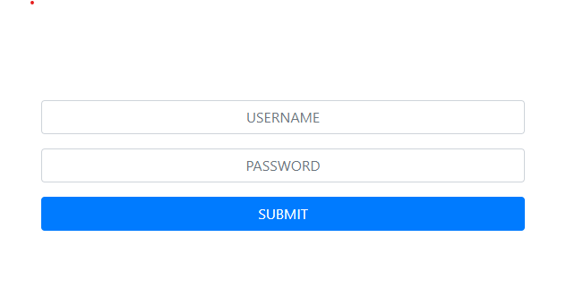
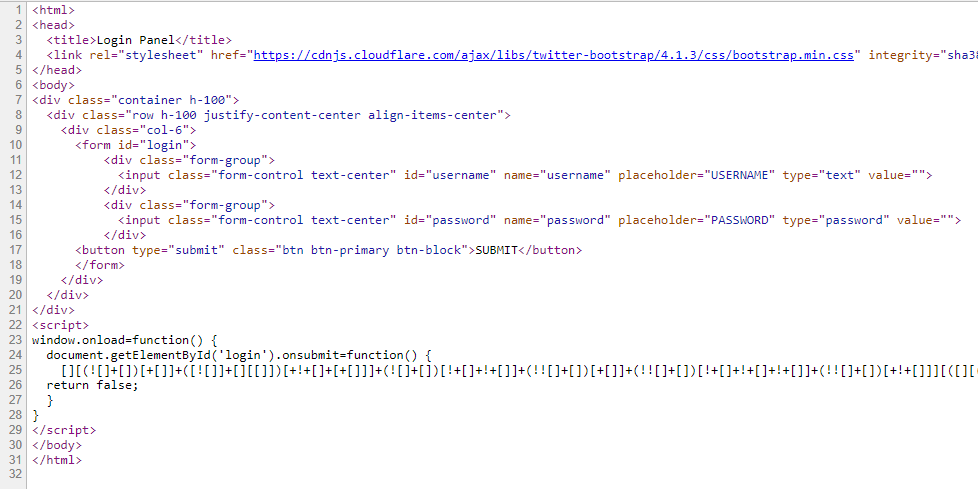

# TRUSTED CLIENT
## Environment
* https://247ctf.com/dashboard
* Developers don't always have time to setup a backend service when prototyping code. Storing credentials on the client side should be fine as long as it's obfuscated right?
* 
## Flow
* 查看原始碼, 發現有一串 jsfuck
    * 
* 丟進去線上 [decoder](https://enkhee-osiris.github.io/Decoder-JSFuck/)
    ```
    function anonymous(
    ) {
    if (this.username.value == 'the_flag_is' && this.password.value == '247CTF{6c91b7f7f12c852f892293d16dba0148}'){ alert('Valid username and password!'); } else { alert('Invalid username and password!'); }
    }
    ```
