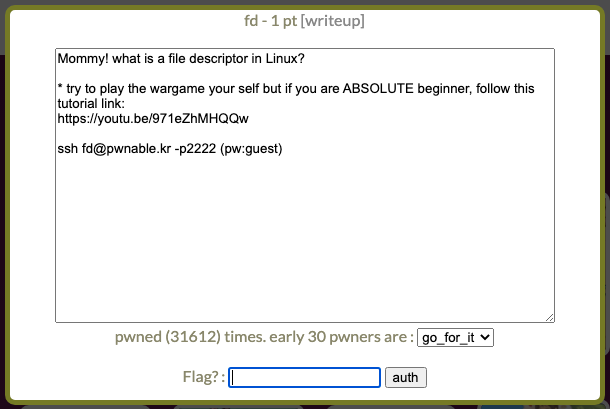

# fd
## Environment
```
ssh fd@pwnable.kr -p2222 
pw: guest
```

## Flow
* 進入 vm 後，首先查看資料夾的檔案和權限
```
fd@pwnable:~$ ls -l
total 16
-r-sr-x--- 1 fd_pwn fd   7322 Jun 11  2014 fd
-rw-r--r-- 1 root   root  418 Jun 11  2014 fd.c
-r--r----- 1 fd_pwn root   50 Jun 11  2014 flag
```
* 可以看到資料夾內有一個無法讀取的檔案: `flag`，大膽猜測該檔案所含內容便為 flag
* 接著查看 `fd.c`，會發現需要讓 char buf 為 "LETMEWIN\n" 才能夠得到 flag
    ```c
    #include <stdio.h>
    #include <stdlib.h>
    #include <string.h>
    char buf[32];
    int main(int argc, char* argv[], char* envp[]){
            if(argc<2){
                    printf("pass argv[1] a number\n");
                    return 0;
            }
            int fd = atoi( argv[1] ) - 0x1234;
            int len = 0;
            len = read(fd, buf, 32);
            if(!strcmp("LETMEWIN\n", buf)){
                    printf("good job :)\n");
                    system("/bin/cat flag");
                    exit(0);
            }
            printf("learn about Linux file IO\n");
            return 0;

    }

    ```
* 而他使用 `read(fd, buf, 32)` 讀取 fd
* file descriptor 可以分為 0, 1, 2 三類，分別為standard input, standard output, standard error
* 因此只要將 fd 設為 0，便可將 `LETMEWIN\n` 輸入
* 找到 0x1234 所對應的十進位數字：4660，將其作為 argument 輸入
```
$ ./fd 4660
```
* 接下來可以發現程式卡住在等著我們輸入，輸入 "LETMEWIN" 並且按下 enter
``` 
fd@pwnable:~$ ./fd 4660
LETMEWIN
good job :)
mommy! I think I know what a file descriptor is!!
```
* 可以看到下面有一行字，便是 flag

## Flag
```
mommy! I think I know what a file descriptor is!!
``` 

